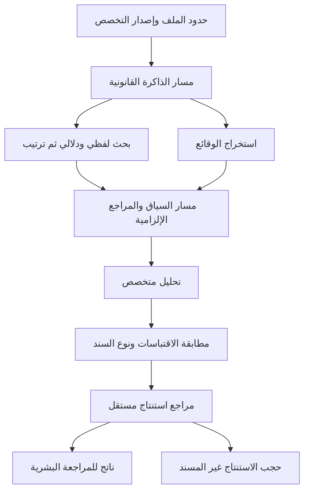

# التنفيذ المصري المقيد بالأدلة

كل أداة لها تعريف تنفيذي في مجلد المسارات المصرية. الكود يقرأ التعريف ويتحقق من التبعيات وينفذ معالجات مسموحة فقط. تغيير أسماء المراحل وحده لا ينشئ وظيفة؛ المعالج والمنطق وعقد الناتج هي التنفيذ.

تفاصيل تحرير التعليمات والإصدارات ومساري الذاكرة والسياق في [دليل التخصص](SPECIALIZATION.ar.md).

## اختلاف المنتجات

| الأداة | الاستخراج المستقل | الناتج الفعلي |
|---|---|---|
| النفاذ | البنود والقانون المختار والاختصاص | بنود، مخاطر، وصياغات مقترحة ذات مراجع |
| النزاعات | الأحداث والادعاءات والأدلة | أحداث مرتبة بتاريخ صريح، ادعاءات مسندة، تعارضات وفجوات |
| الصفقة | جرد الملفات والشروط والالتزامات | سجل مستندات ومخاطر وشروط إغلاق والتزامات |
| التنظيم | النشاط والكيان والمستندات المتاحة | جهات وإجراءات ومتطلبات، مع فرز التبعيات واكتشاف الدوائر |
| العميل | الحالة والمطلوب والمواعيد | موجز من المستندات التي أقر المستخدم صلاحية استخدامها للعميل |

هذه سجلات مولدة لكل تشغيل؛ ليست نظام متابعة حيًا للمواعيد أو الشروط، ولا إرسالًا للعميل أو إيداعًا إلكترونيًا. لا تجمع أداة العميل ملفات الأدوات الأخرى تلقائيًا.

## الذاكرة الضيقة

التصفية قبل أي تضمين أو إرسال: هوية المستخدم، الأداة، قائمة مصادر المكتب، قائمة مصادر الأداة، موضوع الوحدة، الاختصاص المصري، تاريخ سريان النص، تاريخ المراجعة، واختيار قواعد التحكيم. مستندات المهمة لا تدخل بوصفها قانونًا، والقانون لا يثبت واقعة داخل الملف. الوحدات القانونية المشتركة بين أداتين تحتاج تحديد الأداتين صراحة عند الاستيراد.

البيانات القانونية والتضمينات ونتائج الترتيب مشفرة في التخزين. لا تُضاف نتائج الموديل إلى قاعدة المعرفة. لا توجد محادثة مفتوحة تسمح بتحميل ذاكرة من خارج الملف أو استخدام نتائج مستخدم آخر.

## الاسترجاع

تطبيع حروف العربية والتشكيل والأرقام للبحث فقط، مع إبقاء النص الأصلي للاقتباس. بحث لفظي بدرجات تشابه، وبحث دلالي بالتضمينات، ثم دمج رتب بمعامل ٦٠. تمر أفضل النتائج إلى خدمة إعادة ترتيب عصبية منفصلة؛ لا يستعاض عنها بترتيب لفظي إذا فشلت.

المحرك الحالي يحسب التشابه الدلالي الكامل داخل نطاق صغير بحد ٥٠٠ وحدة. ليس فهرسًا موزعًا لملايين الأحكام. هذا قرار يناسب النسخة الحالية ويحتاج قياسًا قبل التوسع إلى قاعدة متجهات مستقلة.

## التحكم في النتيجة

كل عنصر له نوع، أساس واقعي أو قانوني، اقتباسات من الملف والقانون، ومقترح وتاريخ ومسؤول وتبعيات إن وجدت. أي معرف غريب أو اقتباس غير مطابق يُحجب. أنواع مثل المخاطرة والإجراء والاشتراط لا تمر بلا سند قانوني. التواريخ غير الواردة صراحة لا تتحول لمواعيد محسوبة.

مراجع مستقل يتلقى الادعاء كاملًا ومصادره في سياقها. غياب حكمه أو تكراره أو عدم تأييده يمنع إظهار العنصر. تُحذف أيضًا العناصر التي تعتمد على نتائج محجوبة أو تبعيات دائرية. الملخص النهائي وتجميع النتائج يصنعهما الكود، ولا يمر ملخص حر لم يخضع للبوابة.

هذه القيود تحد مخرجات المعرفة غير المسندة؛ لا تمحو معرفة النموذج السابقة من أوزانه، ولا تثبت خلو الاستنتاج من الخطأ. فشل المراجع في اكتشاف استدلال خاطئ يظل خطرًا يحتاج تقييمًا بشريًا.

## الأداء والتخزين المؤقت

توازي بحد مرحلتين. لا يزيد التشغيل المعتاد على أربع مكالمات توليد: استخراجان، تحليل، ومراجعة. مكالمات التضمين والترتيب محسوبة منفصلة، مع حد إجمالي ٤٥ طلبًا ومهلة كلية ٢٤٠ ثانية. لا إعادة محاولة تلقائية غير محدودة.

التضمينات محفوظة أسبوعًا ونتائج الترتيب ربع ساعة. المفاتيح تشمل نطاق المستخدم والأداة والمستندات وإصدار الذاكرة والتخصص والسياسة والخدمات والموديلات والنص المطلوب. السحب أو الاستيراد يبطل تخزين المستخدم. تغير السؤال يعيد تضمين السؤال، ويمكن إعادة استخدام تضمينات النصوص في النطاق نفسه.

ذاكرة سياق الموديل منفصلة عن هذا كله. تُرتب مقدمات النصوص بثبات، وعند اختيار السيرفر المتوافق تُرسل قيمة عزل مشتقة من نطاق المهمة بمفتاح الخادم. سجّلنا ما يبلغه المزود عن الرموز المخزنة؛ لا نخمن عدد كتل الذاكرة أو نسبة التوفير.

## التشغيل البعيد

مستقبل السيرفر الجديد يستورد نفس المحرك والعقود وتعريفات المسارات من الحزمة. الخادم يحتفظ بمفاتيح خدماته، ويتلقى المقتطفات والقانون المسموح. بعد رجوعه تعيد المنصة فحص معرفات المصادر والاقتباسات والتبعيات، وتعيد تجميع العرض محليًا. التنفيذ الداخلي للسيرفر المصرح به يظل ضمن دائرة الثقة؛ سجل خطواته ليس برهانًا تشفيريًا على أداء المراجعة الدلالية.

## تغير البيانات والاعتماد

كل نتيجة مرتبطة بإصدار ذاكرة وسياسة ومستندات. تغييرها أثناء التشغيل يوقف اعتماد النسخة الحالية. عند طلب الاعتماد يعاد فحص وجود المستندات وإصدار الذاكرة والسياسة وصلاحية المراجع. سحب نص يمنع اعتماد النتائج القديمة على الإصدار السابق.

حقول السياسات القديمة التي لم تُنفذ سابقًا، مثل الحذف الزمني التلقائي أو تصنيف الأسرار، لا تصبح منفذة بمجرد وجودها في ملف. هذه النسخة لا تدعي وجود منظومة حوكمة مؤسسية شاملة.
